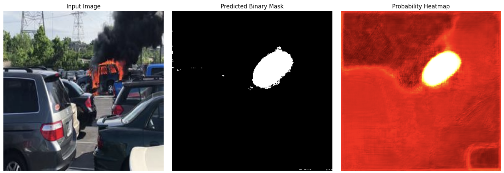

# 🔥 Wildfire Segmentation Using Deep Learning

This project focuses on segmenting wildfire-affected regions from satellite images using a deep learning model. It identifies fire zones at the pixel level, making it easier to visualize the spatial extent of wildfire damage.

The model is based on a U-Net architecture and is trained to generate binary masks that highlight fire-affected areas in satellite imagery.

---

## 🧠 What the Project Does

Given a satellite image as input, the model outputs a binary segmentation mask where:

- **White pixels** indicate fire-affected regions  
- **Black pixels** indicate unaffected regions

This approach supports visual analysis, disaster monitoring, and research into wildfire impact detection using satellite data.

---

## 🖼️ Sample Predictions

| Input Image | Predicted Mask |
|-----------------|----------------|
|  |  |
|  |  |

> *(Make sure to place your sample images inside an `assets/` folder in your repo.)*

---

## 📦 Dataset

- **Name**: [FLAME: Fire-Labeled Atmospheric Monitoring of Earth](https://www.kaggle.com/datasets/datasetsnew/flame)  
- **Source**: Kaggle  
- **Type**: Satellite images with corresponding fire segmentation masks  
- **Purpose**: Enables supervised training of wildfire segmentation models

